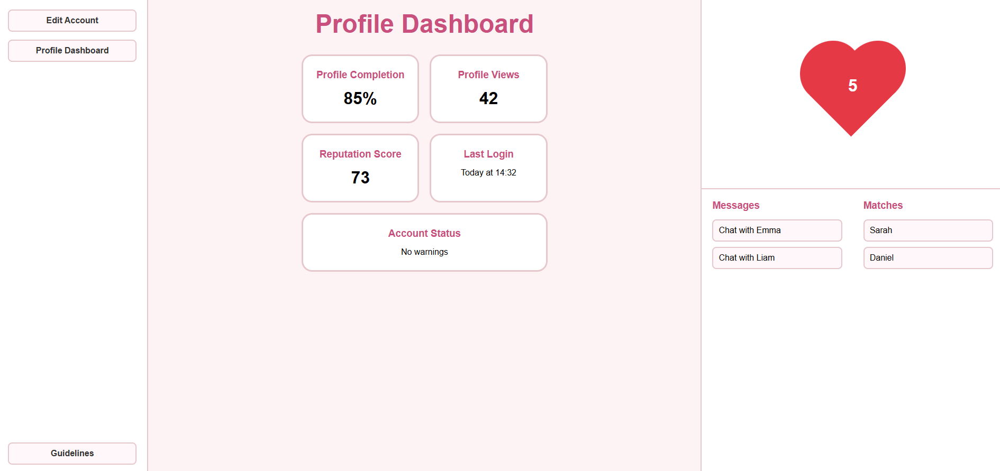
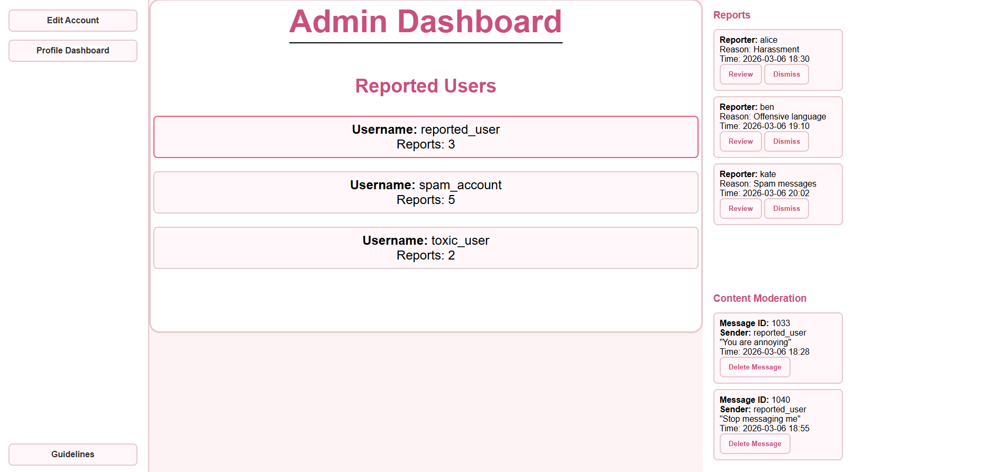
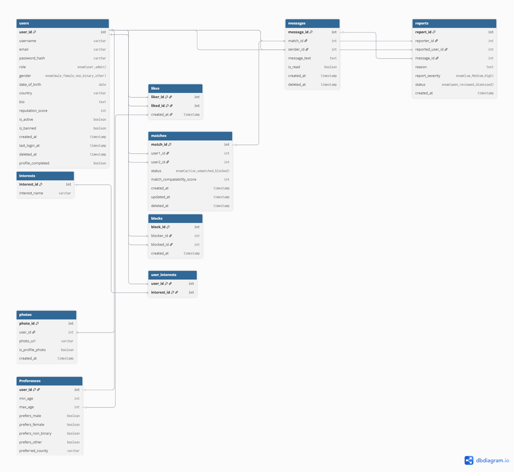
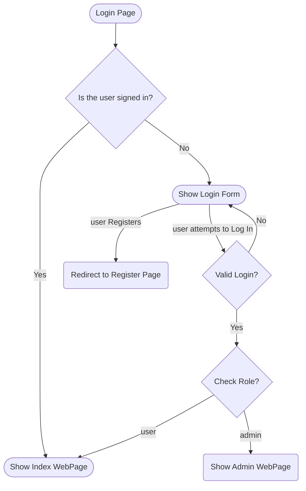
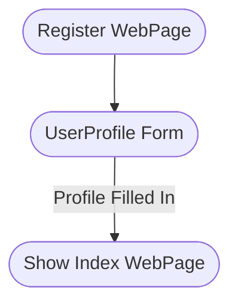
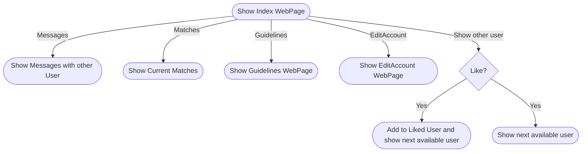
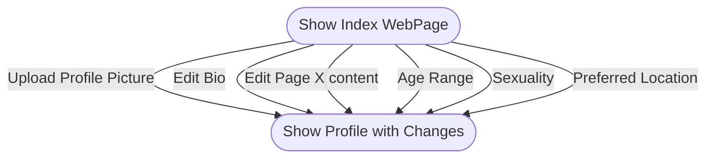
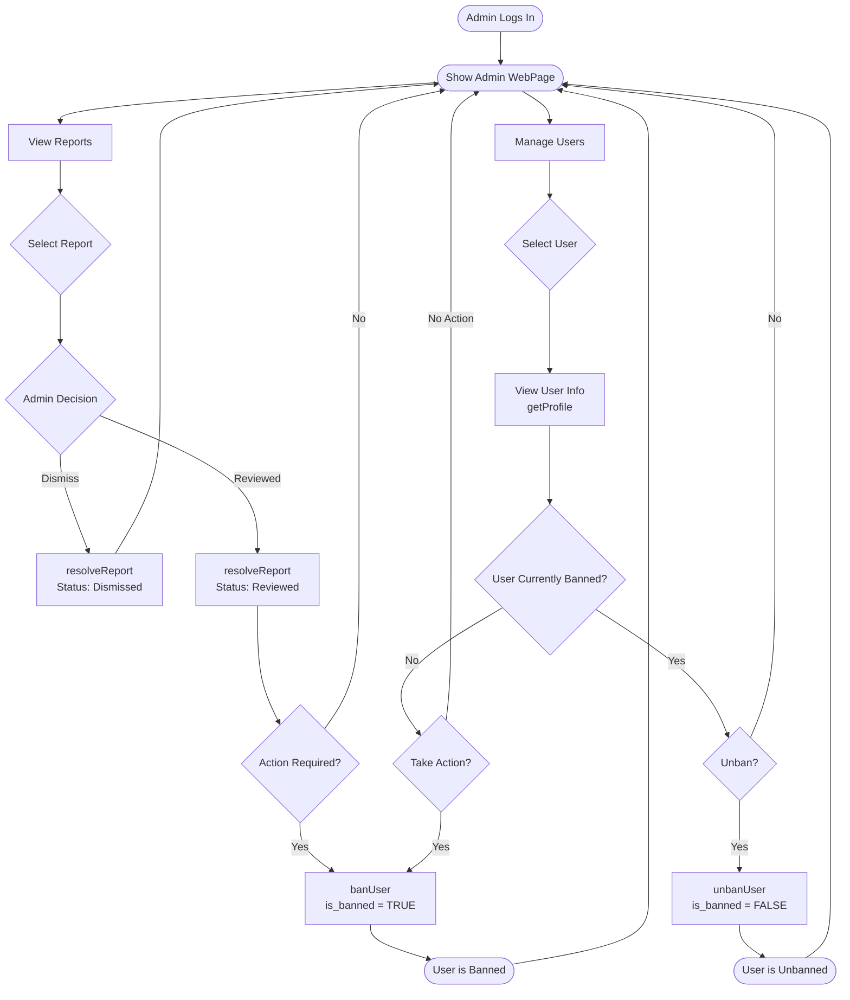

# CS4116 Design Document 

## Fields & Futures 

### Group 2 - Members

James Connolly 23388102

Enda Buckley 2358165

Kaiden 21339465

William 23390794

## Introduction: 

Our dating platform, Fields & Futures, is designed to support meaningful, long-term relationships within rural communities. In a world where many dating apps 
prioritise fast swiping and casual interactions, Fields & Futures focuses on intentional dating rooted in shared values and lifestyle compatibility. The platform 
allows users to create detailed profiles that expertly reflect their personal interests. With a focus on “intentional dating”, Fields & Futures is one of the first 
dating websites to encourage users to give each potential match through and genuine consideration. Users can search for others based on profile information such as age, gender, 
location, and selected interests, with a particular emphasis on rural living and compatibility of long-term intentions. Registered users can express interest in one another. When two 
users mutually indicate interest, a match is formed, and they are able to communicate through our platform’s internal messaging system. Fields & Futures aims to provide a slower, more 
thoughtful alternative to mainstream dating platforms by prioritising authenticity and genuine future planning.

## High-Level Functionality 
On Fields & Futures, there are two types of users, admin users and basic users. The basic users can create their account by inputting an email, username, and a password. After creating 
an account, the user is brought to the user profile page to add their profile pic, bio, personal details, interests, and search settings to their user account. After filling in these 
fields, the user is directed to the main page where they can start matching with other users based on their interests. On this main page, the user has the option to view the website 
guidelines, chat with users they have matched with, and to edit their profile further. 

Users are matched with other users based off of a "Compatibility Score" determined by the matching interests between users,
preferences, and other criteria provided by the users. The functionality of the admin users is to view all existing users, edit user profiles, ban or 
suspend users and activate or deactivate accounts. To achieve this, the admins can view and act on reports submitted by the users.

### Required Functionality

#### User Registration & Profile 

- Create an account and log in securely
- Create and edit a personal profile
- Provide details such as description, interests, preferences, and basic information

Passwords **will not be stored in plain text**

#### Browsing & Searching

- Browse other users 
- Search using multiple criteria 
- Apply filters and sorting

Search functionality will be implemented using database queries as opposed to manually filtering in PHP

#### Matching & Connecting

- Express interest in another user
- Form a connection only if both users indicate interest
- View existing matches
- Complain about harassment from users
- Block other users

#### Messaging

Matched users must be able to communicate through an **internal messaging system**. The system should identify and prevent users from sending phone numbers through the messaging system - we want to keep users on our site as much as possible!

#### Administrative Controls

- Ban or suspend users
- Remove inappropriate content
- Edit user profile

#### Security 

- Password hashing
- Secure session handling
- Input validation and sanitisation
- Protection against basic SQL injection
- No fatal runtime errors
- No hard-coded credentials 
- Clean and consistent navigation
- Logical file structure

### Additional Functionality

#### Intentional Dating

- Including guidelines on how to do Intentional dating
- Setting a limit for number of matches at a time
- Setting a limit for the number of messages between two accounts

#### Compatibility score

- Based on interests, location & sexuality show relevant profiles

#### Ice-Breakers

- Prompt users with Ice-Breakers
- When reaching message limit prompt users with date ideas

## WebPage Mockups

### Google-based UI mockups

#### Login page

#### Register page

#### My Profile page section

#### Edit Account page

#### Guidelines page

#### Profile Overview page

#### Admin Dashboard page

## Database Tables

### Dictionary:

PK - Primary Key

FK - Foreign Key

### User set-up Table
 This table serves as the foundational database structure for the dating platform, handling account registration, personal profile details,and secure login credentials. 
 Additionally, it includes crucial fields like role and ban status to support the required administrative controls for managing 
and moderating the user base.

| Field             | Type                                       | KeyType |
|-------------------|--------------------------------------------|---------|
| user_id           | INT                                        | PK      |
| username          | VARCHAR                                    | UNIQUE  |
| email             | VARCHAR                                    | UNIQUE  |
| password_hash     | VARCHAR                                    |         |
| role              | ENUM('user','admin')                       |         |
| gender            | ENUM('male','female','non_binary','other') |         |
| date_of_birth     | DATE                                       |         |    
| country           | VARCHAR                                    |         |
| bio               | TEXT                                       |         |
| reputation_score  | INT                                        |         |
| is_active         | BOOLEAN                                    |         |
| is_banned         | BOOLEAN                                    |         |
| created_at        | TIMESTAMP                                  |         |
| last_login_at     | TIMESTAMP                                  |         |
| deleted_at        | TIMESTAMP (nullable)                       |         |
| profile_completed | BOOLEAN                                    |         |

### Permissible Interests Table
This table acts as a standardised reference dictionary for all the predefined hobbies and passions users can add to their personal profiles. 
By restricting selections to a consistent set of unique tags rather than free-text entry, it keeps our database clean and makes the required feature of searching and filtering by interests much more accurate and reliable.

| Field         | Type    | KeyType |
|---------------|---------|---------|
| interest_id   | INT     | PK      |
| interest_name | VARCHAR | UNIQUE  |

### User interest Table
This table links individual members directly to their chosen hobbies from the permissible interests list. By matching a user_id with an interest_id,
this junction table efficiently tracks the specific interests of our users, which directly powers our platform's ability to search and filter profiles based on shared passions.

| Field       | Type | KeyType                        |
|-------------|------|--------------------------------|
| user_id     | INT  | PK, FK → users.user_id         |
| interest_id | INT  | PK, FK → interests.interest_id |

### Preferences Table
This table stores the specific dating criteria for each individual in our database, fulfilling the requirement to capture user preferences. By keeping track of requirements like preferred age ranges and county,
it allows our system to proactively suggest compatible matches. Furthermore, it provides the exact data structure we need to power the required search and filtering functionality.
 
 | Field              | Type               | KeyType                |
 |--------------------|--------------------|------------------------|
 | user_id            | INT                | PK, FK → users.user_id |
 | min_age            | INT                |                        |
 | max_age            | INT                |                        |
 | prefers_male       | BOOLEAN            |                        |
 | prefers_female     | BOOLEAN            |                        |
 | prefers_non_binary | BOOLEAN            |                        |
 | prefers_other      | BOOLEAN            |                        |
 | preferred_county   | VARCHAR (Nullable) |                        |

### Likes Table
This table records every instance where a member of our database expresses interest in another user. By tracking exactly who likes whom, 
it allows our platform to manage user connection to be used in the matching process.

| Field      | Type      | KeyType                |
|------------|-----------|------------------------|
| liker_id   | INT       | PK, FK → users.user_id |
| liked_id   | INT       | PK, FK → users.user_id |
| created_at | TIMESTAMP |                        |

### Matches Table
This table records the established connections within our database when two users successfully express mutual interest. By tracking the exact status of a relationship (such as active,
unmatched, or blocked), it enables our platform to manage clear state transitions and allows users to securely view their existing matches. This table also
includes a compatibility score associated with each match to help us proactively evaluate and suggest high-quality pairings based on user preferences.

| Field                     | Type                                 | KeyType            |
|---------------------------|--------------------------------------|--------------------|
| match_id                  | INT                                  | PK                 |
| user1_id                  | INT                                  | FK → users.user_id |
| user2_id                  | INT                                  | FK → users.user_id |
| status                    | ENUM('active','unmatched','blocked') |                    |
| created_at                | TIMESTAMP                            |                    |
| match_compatability_score | INT                                  |                    |
| updated_at                | TIMESTAMP                            |                    |
| deleted_at                | TIMESTAMP (nullable)                 |                    |

### Messages Table
This table powers the internal messaging system in our database, securely facilitating communication between users who have successfully matched. 
By linking the message text to a specific match id, it ensures conversations only happen between mutual connections and that the timestamps accurately reflect the time of the message.

| Field        | Type                 | KeyType               |
|--------------|----------------------|-----------------------|
| message_id   | INT                  | PK                    |
| match_id     | INT                  | FK → matches.match_id |
| sender_id    | INT                  | FK → users.user_id    |
| message_text | TEXT                 |                       |
| is_read      | BOOLEAN              |                       |
| created_at   | TIMESTAMP            |                       |
| deleted_at   | TIMESTAMP (nullable) |                       |

### Blocks Table
This table is for keeping track of exactly who has blocked who in our database. 
It's necessary so that we can easily stop unwanted interactions and make sure a blocked person can't see or message the user who blocked them. 
Basically, it handles the privacy side of things to keep the platform safe and comfortable for everyone.

| Field      | Type      | KeyType            |
|------------|-----------|--------------------|
| block_id   | INT       | PK                 |
| blocker_id | INT       | FK → users.user_id |
| blocked_id | INT       | FK → users.user_id |
| created_at | TIMESTAMP |                    |

### Reports Table
This table acts as the moderation hub in our database, letting users officially complain about harassment or inappropriate behaviour from others. 
It's necessary so that our admin team can track the status of each issue, review specific messages, and decide if someone needs to be banned or suspended. 
Ultimately, it organises all these reports so we can effectively moderate the platform.

| Field            | Type                                    | KeyType            |
|------------------|-----------------------------------------|--------------------|
| report_id        | INT                                     | PK                 |
| reporter_id      | INT                                     | FK → users.user_id |
| reported_user_id | INT                                     | FK → users.user_id |
| message_id       | INT (nullable FK → messages.message_id) |                    |
| reason           | TEXT                                    |                    |
| report_severity  | ENUM('Low','Medium','High')             |                    |
| status           | ENUM('open','reviewed','dismissed')     |                    |
| created_at       | TIMESTAMP                               |                    |

### Photos Table
This table stores the links for all the pictures our users upload to create and edit a personal profile. 
It's necessary in our database to link each image to the right person and explicitly flag their main display picture so people can actually see their potential matches when they browse other users.

| Field            | Type                      | KeyType            |
|------------------|---------------------------|--------------------|
| photo_id         | INT                       | PK                 |
| user_id          | INT                       | FK → users.user_id |
| photo_url        | VARCHAR                   |                    |
| is_profile_photo | BOOLEAN                   |                    |
| created_at       | TIMESTAMP                 |                    |

### Entity Relationship Diagram

## Process Chart List

### User

#### Login

#### Registration

#### Index page

#### Edit Account

#### 

### Admin

#### Admin Actions

## Process Tables

| Process No.          | 1                                                                                                                                                                                                                                                                                                                                     |
|----------------------|---------------------------------------------------------------------------------------------------------------------------------------------------------------------------------------------------------------------------------------------------------------------------------------------------------------------------------------|
| Title                | registrationValidation                                                                                                                                                                                                                                                                                                                |
| Brief Description    | Validates a users credentials when registering                                                                                                                                                                                                                                                                                        |
| Inputs               | Username, Email, Password                                                                                                                                                                                                                                                                                                             |
| Detailed Description | Validates that an account does not already exist with the username or email a user is attempting to register with. If an account exists in the database with either of these an error pops up and the user is prompted to enter new credentials. If these credentials are not found, the createAccount process is allowed to proceed. |
| Outputs              | userID                                                                                                                                                                                                                                                                                                                                |

| Process No.          | 2                                                                                            |
|----------------------|----------------------------------------------------------------------------------------------|
| Title                | createAccount                                                                                |
| Brief Description    | Creates a new user account after successful registration                                     |
| Inputs               | Username, Email, Password                                                                    |
| Detailed Description | Adds a new user to the database, assigning them a unique user_id and hashing their password. |
| Output               | User gets prompted to login using their credentials                                          |

| Process No.          | 3                                                                                                                                           |
|----------------------|---------------------------------------------------------------------------------------------------------------------------------------------|
| Title                | loginValidation                                                                                                                             |
| Brief Description    | Validates a users credentials when attempting to log in                                                                                     |
| Inputs               | Username/Email, Password                                                                                                                    |
| Detailed Description | Validates that the username/email and password entered match an existing account. Returns a boolean depending on the success of this check. |
| Output               | Boolean True/False to indicate if login should be allowed.                                                                                  |

| Process No.          | 4                                                                                                                     |
|----------------------|-----------------------------------------------------------------------------------------------------------------------|
| Title                | profileSetup                                                                                                          |
| Brief Description    | Checks if a users profile has been setup.                                                                             |
| Inputs               | Email/Username                                                                                                        |
| Detailed Description | When a user is logging in, their credentials are checked to see if their account has had its profile setup completed. |
| Output               | Boolean True/False to indicate if the user should be sent to the inital profile setup page or the websites home page. |

| Process No.          | 5                                                                                                                                                               |
|----------------------|-----------------------------------------------------------------------------------------------------------------------------------------------------------------|
| Title                | loginUser                                                                                                                                                       |
| Brief Description    | Logs a user into the website                                                                                                                                    |
| Inputs               | loginValidation Boolean, profileSetup Boolean                                                                                                                   |
| Detailed Description | Based on the values returned from processes 3 and 4, this process will either deny or allow a user to be logged in, and send them to the page relevant to them. |
| Output               | User is either logged in or denied. If logged in they are sent to the initial profile setup if it has not yet been completed or the website homepage if it has. |

| Process No.          | 6                                                                                                                                                                                          |
|----------------------|--------------------------------------------------------------------------------------------------------------------------------------------------------------------------------------------|
| Title                | setCompleteness                                                                                                                                                                            |
| Brief Description    | Sets the completeness percentage of a users profile.                                                                                                                                       |
| Inputs               | Profile Photo, Bio, Name, Age, Gender, Location, Type, Interests                                                                                                                           |
| Detailed Description | When filling out a profile initially, a completion percentage is present on the page which dynamically updates as the profile is filled out. Only certain fields count towards this value. |
| Output               | Completion Percentage                                                                                                                                                                      |

| Process No.          | 7                                                                                                                                                                                           |
|----------------------|---------------------------------------------------------------------------------------------------------------------------------------------------------------------------------------------|
| Title                | requiredCheck                                                                                                                                                                               |
| Brief Description    | Checks if the required values are filled out during profile setup.                                                                                                                          |
| Inputs               | Name, Age, Location, Bio, Profile Photo, Gender                                                                                                                                             |
| Detailed Description | If these required values are not filled out, the user is not allowed to save their profile. If they are, then the information they provided will be saved to their profile using process 8. |
| Output               | Boolean True or False, to allow the user to save the profile onto the database                                                                                                              |

| Process No.          | 8                                                                              |
|----------------------|--------------------------------------------------------------------------------|
| Title                | saveProfile                                                                    |
| Brief Description    | Saves a users profile information                                              |
| Inputs               | Profile Photo, Bio, Name, Age, Gender, Location, Type, Interests               |
| Detailed Description | This takes all the inputs and saves them to the database                       |
| Output               | Sends the user to their profile webpage and saves their values to the database |

| Process No.          | 9                                                                      |
|----------------------|------------------------------------------------------------------------|
| Title                | getProfile                                                             |
| Brief Description    | Return a representation of the selected users profile                  |
| Inputs               | userID                                                                 |
| Detailed Description | This function will return a text version of the selected users profile |
| Output               | A String with all the information about the selected users profile     |

| Process No.          | 10                                                                    |
|----------------------|-----------------------------------------------------------------------|
| Title                | changeEmail                                                           |
| Brief Description    | Allows a user to change email                                         |
| Inputs               | Oldemail, Newemail & password                                         |
| Detailed Description | This will replace the saved email for the current user                |
| Output               | Boolean True or False, To tell the user the action has been completed |

| Process No.          | 11                                                        |
|----------------------|-----------------------------------------------------------|
| Title                | changePassword                                            |
| Brief Description    | Allows a user to change password                          |
| Inputs               | Email, Oldpassword & Newpassword                          |
| Detailed Description | This will replace the saved password for the current user |
| Output               | Boolean, To tell the user the action has been completed   |

| Process No.          | 12                                                                |
|----------------------|-------------------------------------------------------------------|
| Title                | setProfilePhoto                                                   |
| Brief Description    | Allows a user to set their profile photo                          |
| Inputs               | Any image format HTML accepts                                     |
| Detailed Description | Let's a user provide images which will be used with their profile |
| Output               | Boolean, To tell the user the action has been completed           |

| Process No.          | 13                                                     |
|----------------------|--------------------------------------------------------|
| Title                | getProfilePhoto                                        |
| Brief Description    | Allows a user to check the set profile photo           |
| Inputs               | userID                                                 |
| Detailed Description | Let's a user get the photos set to their profile photo |
| Output               | Zip file with the image                                |

| Process No.          | 14                                                                                 |
|----------------------|------------------------------------------------------------------------------------|
| Title                | setAdditionalPhotos                                                                |
| Brief Description    | Allows a user to set their additional photos                                       |
| Inputs               | Any image format HTML accepts                                                      |
| Detailed Description | Let's a user provide images which will be used with their additonal photos section |
| Output               | Boolean, To tell the user the action has been completed                            |

| Process No.          | 15                                                         |
|----------------------|------------------------------------------------------------|
| Title                | getAdditionalPhotos                                        |
| Brief Description    | Allows a user to check the set additional photos           |
| Inputs               | userID                                                     |
| Detailed Description | Let's a user get the photos set to their additional photos |
| Output               | Zip file with the images                                   |

| Process No.          | 16                                                                   |
|----------------------|----------------------------------------------------------------------|
| Title                | setBio                                                               |
| Brief Description    | Let's a user set their profile bio                                   |
| Inputs               | String                                                               |
| Detailed Description | A user will fill in a text field which will be saved to the database |
| Output               | Boolean, To tell the user the action has been completed              |

| Process No.          | 17                                                                          |
|----------------------|-----------------------------------------------------------------------------|
| Title                | getBio                                                                      |
| Brief Description    | Returns the Bio for the selected users profile                              |
| Inputs               | userID                                                                      |
| Detailed Description | Returns the String that has been saved into the database for the users' Bio |
| Output               | String, of the attached Bio                                                 |

| Process No.          | 18                                                      |
|----------------------|---------------------------------------------------------|
| Title                | setName                                                 |
| Brief Description    | Let's a user set their name                             |
| Inputs               | String                                                  |
| Detailed Description | Saves the users chosen name to the database             |
| Output               | Boolean, To tell the user the action has been completed |

| Process No.          | 19                                                                           |
|----------------------|------------------------------------------------------------------------------|
| Title                | getName                                                                      |
| Brief Description    | Returns the Name for the selected user                                       |
| Inputs               | userID                                                                       |
| Detailed Description | Returns the String that has been saved into the database for the users' Name |
| Output               | String                                                                       |

| Process No.          | 20                                                      |
|----------------------|---------------------------------------------------------|
| Title                | setAge                                                  |
| Brief Description    | Let's a user set their Age                              |
| Inputs               | Int                                                     |
| Detailed Description | Saves a users' chosen Age to the database               |
| Output               | Boolean, To tell the user the action has been completed |

| Process No.          | 21                                                                  |
|----------------------|---------------------------------------------------------------------|
| Title                | getAge                                                              |
| Brief Description    | Returns a users' Age                                                |
| Inputs               | userID                                                              |
| Detailed Description | Returns the Int saved into the database for the selected users' age |
| Output               | Int, Of the users' Age                                              |

| Process No.          | 22                                                      |
|----------------------|---------------------------------------------------------|
| Title                | setLocation                                             |
| Brief Description    | Let's a user set their Location                         |
| Inputs               | String                                                  |
| Detailed Description | Saves a users' chosen Location to the database          |
| Output               | Boolean, To tell the user the action has been completed |
 

| Process No.          | 23                                                                          |
|----------------------|-----------------------------------------------------------------------------|
| Title                | getLocation                                                                 |
| Brief Description    | Returns a users' Location                                                   |
| Inputs               | userID                                                                      |
| Detailed Description | Returns the String saved into the database for the selected users' Location |
| Output               | String, Of the users' Location                                              |

| Process No.          | 24                                                                                                                      |
|----------------------|-------------------------------------------------------------------------------------------------------------------------|
| Title                | calculateReputation                                                                                                     |
| Brief Description    | Calculates and updates a users reputation                                                                               |
| Inputs               | UserID                                                                                                                  |
| Detailed Description | Calculates the users reputation score by identifying reports against the user, and updates the recorded reputation      |
| Output               | Returns updated reputation score. Internal method never seen by the user so does not need to display anything on-screen |

| Process No.          | 25                                                                                                                    |
|----------------------|-----------------------------------------------------------------------------------------------------------------------|
| Title                | getReputation                                                                                                         |
| Brief Description    | Returns the users current reputation score                                                                            |
| Inputs               | Necessary for process #24. Gets the users current reputation score                                                    |
| Detailed Description | Retrieves the users reputation score.                                                                                 |
| Output               | Returns users reputation score. Internal method never seen by the user so does not need to display anything on-screen |

| Process No.          | 26                                                      |
|----------------------|---------------------------------------------------------|
| Title                | setType                                                 |
| Brief Description    | Let's a user set their Type                             |
| Inputs               | Enum                                                    |
| Detailed Description | Saves a users' chosen Type to the database              |
| Output               | Boolean, To tell the user the action has been completed |

| Process No.          | 27                                                                    |
|----------------------|-----------------------------------------------------------------------|
| Title                | getType                                                               |
| Brief Description    | Returns a users' Type                                                 |
| Inputs               | userID                                                                |
| Detailed Description | Returns the Enum saved into the database for the selected users' Type |
| Output               | Enum, Of the users' Type                                              |

| Process No.          | 28                                                      |
|----------------------|---------------------------------------------------------|
| Title                | setInterests                                            |
| Brief Description    | Let's a user set their Interests                        |
| Inputs               | Enum                                                    |
| Detailed Description | Saves a users' chosen Interests to the database         |
| Output               | Boolean, To tell the user the action has been completed |

| Process No.          | 29                                                                         |
|----------------------|----------------------------------------------------------------------------|
| Title                | getInterests                                                               |
| Brief Description    | Returns a users' Interests                                                 |
| Inputs               | userID                                                                     |
| Detailed Description | Returns the Enum saved into the database for the selected users' Interests |
| Output               | Enum of the users' Type                                                    |

| Process No.          | 30                                                                                                                                            |
|----------------------|-----------------------------------------------------------------------------------------------------------------------------------------------|
| Title                | newMatch                                                                                                                                      |
| Brief Description    | Creates a new match between two users                                                                                                         |
| Inputs               | user1_id, user2_id                                                                                                                            |
| Detailed Description | Creates a new entry in the matches table, assigning it a unique match_id. It is given a created_at timestamp and its status is set to active. |
| Output               | The user is informed that a new match has been created and process 32 is called to decrement their remaining matches.                         |

| Process No.          | 31                                                                                                                            |
|----------------------|-------------------------------------------------------------------------------------------------------------------------------|
| Title                | removeMatch                                                                                                                   |
| Brief Description    | Changes a matches status                                                                                                      |
| Inputs               | user1_id, user2_id                                                                                                            |
| Detailed Description | Changes a matches status from active to inactive/blocked depending on if the match was ended normally, or a user was blocked. |
| Output               | The user is informed that the match has been removed and process 32 is called to increment their remaining matches.           |

| Process No.          | 32                                                                                             |
|----------------------|------------------------------------------------------------------------------------------------|
| Title                | matchesRemaining                                                                               |
| Brief Description    | Sets the number of remaining matches a user has and returns the value                          |
| Inputs               | user_id                                                                                        |
| Detailed Description | Checks the matches table for active matches associated with the user_id and updates the value. |
| Output               | INT                                                                                            ||
 

| Process No.          | 33                                                                                                                       |
|----------------------|--------------------------------------------------------------------------------------------------------------------------|
| Title                | sendMessage                                                                                                              |
| Brief Description    | Sends a message to another user                                                                                          |
| Inputs               | match_id, sender_id, message_text                                                                                        |
| Detailed Description | Creates a new message in the messages table, using the senders id and the match id to identify the sender and recipient. |
| Output               | created_at TIMESTAMP, for the message                                                                                    |

| Process No.          | 34                                                                                              |
|----------------------|-------------------------------------------------------------------------------------------------|
| Title                | getMessages                                                                                     |
| Brief Description    | Gets a users messages                                                                           |
| Inputs               | match_id                                                                                        |
| Detailed Description | Returns the message history between two users by querying their match id in the messages table. |
| Output               | message_text for each message found                                                             |

| Process No.          | 35                                                                                                           |
|----------------------|--------------------------------------------------------------------------------------------------------------|
| Title                | setRead                                                                                                      |
| Brief Description    | Sets a messages status to read                                                                               |
| Inputs               | message_id                                                                                                   |
| Detailed Description | Once a message is read by the recipient, its is_read value is updated to be TRUE and this value is returned. |
| Output               | Boolean TRUE, to let the user know the message has been read                                                 |
 

| Process No.          | 36                                                                                                                                  |
|----------------------|-------------------------------------------------------------------------------------------------------------------------------------|
| Title                | sendLike                                                                                                                            |
| Brief Description    | Sends a like from one user to another.                                                                                              |
| Inputs               | liker_id, liked_id                                                                                                                  |
| Detailed Description | Creates a new like in the likes table, using the liker_id and liked_id for identification. It is then given a created_at timestamp. |
| Output               | Boolean response that the like was successful.                                                                                      |
 

| Process No.          | 37                                                                                                                               |
|----------------------|----------------------------------------------------------------------------------------------------------------------------------|
| Title                | getLikes                                                                                                                         |
| Brief Description    | Returns all the likes for a user.                                                                                                |
| Inputs               | liked_id                                                                                                                         |
| Detailed Description | Using the liked_id, all of the likes sent to this id are counted and returned when a user wants to see how many likes they have. |
| Output               | INT amount of likes a user has received                                                                                          |
 

| Process No.          | 38                                                                                                                                                                                             |
|----------------------|------------------------------------------------------------------------------------------------------------------------------------------------------------------------------------------------|
| Title                | blockUser                                                                                                                                                                                      |
| Brief Description    | Blocks another user                                                                                                                                                                            |
| Inputs               | blocker_id, blocked_id                                                                                                                                                                         |
| Detailed Description | When a user blocks another user, a new block is created in the blocks table with a unique block_id. Both of their individual id's are stored here along with a created_at field for the block. |
| Output               | Boolean response to inform user that they have successfully blocked the other.                                                                                                                 |

| Process No.          | 39                                                                               |
|----------------------|----------------------------------------------------------------------------------|
| Title                | unblockUser                                                                      |
| Brief Description    | Unblocks another user                                                            |
| Inputs               | block_id                                                                         |
| Detailed Description | Sets a blocks status to inactive in the blocks table using the block_id.         |
| Output               | Boolean response to inform user that they have successfully unblocked the other. |
 

| Process No.          | 40                                                                                                                   |
|----------------------|----------------------------------------------------------------------------------------------------------------------|
| Title                | setActive                                                                                                            |
| Brief Description    | Toggles a users account status                                                                                       |
| Inputs               | user_id                                                                                                              |
| Detailed Description | Toggles a users account between active & deactivated by modifying the is_active field associated with their user_id. |
| Output               | None                                                                                                                 |
 

| Process No.          | 41                                                                    |
|----------------------|-----------------------------------------------------------------------|
| Title                | getActive                                                             |
| Brief Description    | Gets a users account status                                           |
| Inputs               | user_id                                                               |
| Detailed Description | Returns the current status of a users account through a boolean value |
| Output               | Boolean to represent if account is active                             |

| Process No.          | 42                                                                                                             |
|----------------------|----------------------------------------------------------------------------------------------------------------|
| Title                | sendReport                                                                                                     |
| Brief Description    | Creates a report against another user                                                                          |
| Inputs               | reporter_id, reported_user_id, reason, report_severity                                                         |
| Detailed Description | Creates a new report in the reports table and maps it to the reporting and reported users using their user_id. |
| Output               | Boolean to inform the user the report was successfully created.                                                |

| Process No.          | 43                                                                                    |
|----------------------|---------------------------------------------------------------------------------------|
| Title                | getReportStatus                                                                       |
| Brief Description    | Gets a reports status                                                                 |
| Inputs               | report_id                                                                             |
| Detailed Description | Returns the status of a report from the reports table by searching for the report_id. |
| Output               | ENUM for status                                                                       | 

| Process No.          | 44                                                                                                        |
|----------------------|-----------------------------------------------------------------------------------------------------------|
| Title                | resolveReport                                                                                             |
| Brief Description    | Allows an admin to resolve a report.                                                                      |
| Inputs               | report_id                                                                                                 |
| Detailed Description | An admin can review a report and set its status to reviewed or dismissed using buttons on the admin page. |
| Output               | None                                                                                                      |
 

| Process No.          | 45                                                                                                    |
|----------------------|-------------------------------------------------------------------------------------------------------|
| Title                | banUser                                                                                               |
| Brief Description    | Allows an admin to ban a user.                                                                        |
| Inputs               | user_id                                                                                               |
| Detailed Description | An admin can enter a users id to ban them from the website, which sets their is_banned value to true. |
| Output               | Boolean is_banned, to represent the account is now banned.                                            |
 

| Process No.          | 46                                                                                                       |
|----------------------|----------------------------------------------------------------------------------------------------------|
| Title                | unbanUser                                                                                                |
| Brief Description    | Allows an admin to unban a user.                                                                         |
| Inputs               | user_id                                                                                                  |
| Detailed Description | An admin can enter a users id to unban them from the website, which sets their is_banned value to false. |
| Output               | Boolean is_banned, to represent the account has been unbanned.                                           |

| Process No.          | 47                                                                                                 |
|----------------------|----------------------------------------------------------------------------------------------------|
| Title                | setGender                                                                                          |
| Brief Description    | Sets a users gender                                                                                |
| Inputs               | user_id, gender                                                                                    |
| Detailed Description | Sets the gender for a users account in the user set-up table to be whatever gender the user chose. |
| Output               | Boolean to inform the user the action was successful.                                              |

| Process No.          | 48                                                                               |
|----------------------|----------------------------------------------------------------------------------|
| Title                | getGender                                                                        |
| Brief Description    | Returns a users gender                                                           |
| Inputs               | user_id                                                                          |
| Detailed Description | Returns a users gender from the user set-up table by searching for their user_id |
| Output               | ENUM for gender                                                                  |