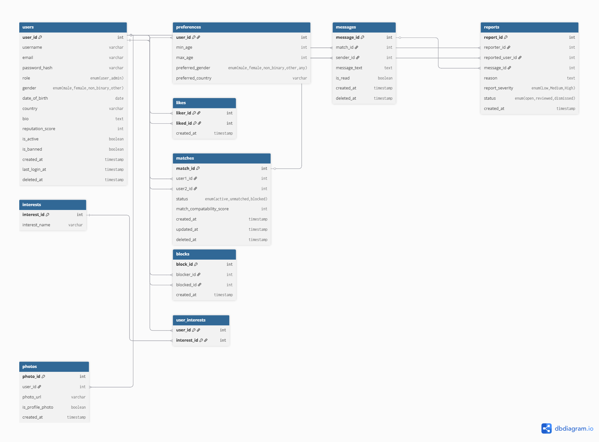

# CS4116 Design Document 

## Fields & Futures 

### Group 2 - Members 

James Connolly 23388102
Enda Buckley 2358165
Kaiden 21339465
William 23390794

## Introduction: 

Our dating platform, Fields & Futures, is designed to support meaningful, long-term relationships within rural communities. In a world where many dating apps prioritise fast swiping and casual interactions, Fields & Futures focuses on intentional dating rooted in shared values and lifestyle compatibility. The platform allows users to create detailed profiles that expertly reflect their personal interests. With a focus on “intentional dating”, Fields & Futures is one of the first dating websites to encourage users to give each potential matches through and genuine consideration. Users can search for others based on profile information such as age, gender, location, and selected interests, with a particular emphasis on rural living and compatibility of long-term intentions. Registered users can express interest in one another. When two users mutually indicate interest, a match is formed, and they are able to communicate through our platform’s internal messaging system. Fields & Futures aims to provide a slower, more thoughtful alternative to mainstream dating platforms by prioritising authenticity and genuine future planning.

## High-Level Functionality 
On Fields & Futures, there are two types of users, admin users and basic users. The basic users can create their account by inputting an email, username and a password. After creating an account, the user is brought to the user profile page to add their profile pic, bio, personal details, interests and search settings to their user account. After filling in these fields, the user is directed to the main page where they can start matching with other users based on their interests. On this main page, the user has the options to view the website guidelines, chat with users they have matched with and to edit their profile further. The functionality of the admin users is to view all existing users, edit user profiles, ban or suspend users and activate or deactivate accounts. To achieve this, the admins can view and act on reports that were submitted by the users.

### Required Functionality

#### User Registration & Profile 

- Create an account and log in securely
- Create and edit a personal profile
- Provide details such as description, interests, preferences, and basic information

Passwords **must not be stored in plain text**

#### Browsing & Searching

- Browse other users 
- Search using multiple criteria 
- Apply filters and sorting

Search functionality must be implemented using database queries, not manual filtering in PHP

#### Matching & Connecting

- Express interest in another user
- Form a connection only if both users indicate interest
- View existing matches
- Complain about harassment from users
- Block other users

#### Messaging

Matched users must be able to communicate through an **internal messaging system**. The system should identify and prevent users from sending phone numbers through the messaging system - we want to keep users on our site as much as possible!

#### Administrative Controls

- Ban or suspend users
- Remove inappropriate content
- Edit user profile

#### Security 

- Password hashing
- Secure session handling
- Input validation and sanitisation
- Protection against basic SQL injection
- No fatal runtime errors
- No hard-coded credentials 
- Clean and consistent navigation
- Logical file structure

### Additional Functionality

#### Intentional Dating

- Including guidelines on how to do Intentional dating
- Setting a limit for number of matches at a time
- Setting a limit for the number of messages between two accounts

#### Compatibility score

- Based on interests, location & sexuality show relevant profiles

#### Ice-Breakers

- Prompt users with Ice-Breakers
- When reaching message limit prompt users with date ideas

## WebPage Mockups

### Google-based UI mockups

#### Login page

#### Register page

#### My Profile page section

#### Edit Account page

#### Guidelines page

## Database Tables

### User set-up Table
| Field             | Type                                       | KeyType |
|-------------------|--------------------------------------------|---------|
| user_id           | INT                                        | PK      |
| username          | VARCHAR                                    | UNIQUE  |
| email             | VARCHAR                                    | UNIQUE  |
| password_hash     | VARCHAR                                    |         |
| role              | ENUM('user','admin')                       |         |
| gender            | ENUM('male','female','non_binary','other') |         |
| date_of_birth     | DATE                                       |         |
| country           | VARCHAR                                    |         |
| bio               | TEXT                                       |         |
| reputation_score  | INT                                        |         |
| is_active         | BOOLEAN                                    |         |
| is_banned         | BOOLEAN                                    |         |
| created_at        | TIMESTAMP                                  |         |
| last_login_at     | TIMESTAMP                                  |         |
| deleted_at        | TIMESTAMP (nullable)                       |         |
| profile_completed | BOOLEAN                                    |         |

### Permissible Interests Table
| Field         | Type    | KeyType |
|---------------|---------|---------|
| interest_id   | INT     | PK      |
| interest_name | VARCHAR | UNIQUE  |

### User interest Table
| Field       | Type | KeyType                        |
|-------------|------|--------------------------------|
| user_id     | INT  | PK, FK → users.user_id         |
| interest_id | INT  | PK, FK → interests.interest_id |

### Preferences Table
| Field             | Type                                             | KeyType                |
|-------------------|--------------------------------------------------|------------------------|
| user_id           | INT                                              | PK, FK → users.user_id |
| min_age           | INT                                              |                        |
| max_age           | INT                                              |                        |
| preferred_gender  | ENUM('male','female','non_binary','other','any') |                        |
| preferred_country | VARCHAR                                          |                        |

### Likes Table
| Field      | Type      | KeyType                |
|------------|-----------|------------------------|
| liker_id   | INT       | PK, FK → users.user_id |
| liked_id   | INT       | PK, FK → users.user_id |
| created_at | TIMESTAMP |                        |

### Matches Table
| Field                     | Type                                 | KeyType            |
|---------------------------|--------------------------------------|--------------------|
| match_id                  | INT                                  | PK                 |
| user1_id                  | INT                                  | FK → users.user_id |
| user2_id                  | INT                                  | FK → users.user_id |
| status                    | ENUM('active','unmatched','blocked') |                    |
| created_at                | TIMESTAMP                            |                    |
| match_compatability_score | INT                                  |                    |
| updated_at                | TIMESTAMP                            |                    |
| deleted_at                | TIMESTAMP (nullable)                 |                    |

### Messages Table
| Field        | Type                 | KeyType               |
|--------------|----------------------|-----------------------|
| message_id   | INT                  | PK                    |
| match_id     | INT                  | FK → matches.match_id |
| sender_id    | INT                  | FK → users.user_id    |
| message_text | TEXT                 |                       |
| is_read      | BOOLEAN              |                       |
| created_at   | TIMESTAMP            |                       |
| deleted_at   | TIMESTAMP (nullable) |                       |

### Blocks Table
| Field      | Type      | KeyType            |
|------------|-----------|--------------------|
| block_id   | INT       | PK                 |
| blocker_id | INT       | FK → users.user_id |
| blocked_id | INT       | FK → users.user_id |
| created_at | TIMESTAMP |                    |

### Reports Table
| Field            | Type                                    | KeyType            |
|------------------|-----------------------------------------|--------------------|
| report_id        | INT                                     | PK                 |
| reporter_id      | INT                                     | FK → users.user_id |
| reported_user_id | INT                                     | FK → users.user_id |
| message_id       | INT (nullable FK → messages.message_id) |                    |
| reason           | TEXT                                    |                    |
| report_severity  | ENUM('Low','Medium','High')             |                    |
| status           | ENUM('open','reviewed','dismissed')     |                    |
| created_at       | TIMESTAMP                               |                    |

### Photos Table
| Field            | Type                      | KeyType            |
|------------------|---------------------------|--------------------|
| photo_id         | INT                       | PK                 |
| user_id          | INT                       | FK → users.user_id |
| photo_url        | VARCHAR                   |                    |
| is_profile_photo | BOOLEAN                   |                    |
| created_at       | TIMESTAMP                 |                    |

### Entity Relationship Diagram

## Process Chart List

### User

#### Path Index

#### Login

#### Registration

#### Index page

#### Inbox

### Admin

#### Path Index

#### Login

#### Profile viewing

## Process Tables

| Process No.          | 1                                                                                                                                                                                                                                                                                                                                     |
|----------------------|---------------------------------------------------------------------------------------------------------------------------------------------------------------------------------------------------------------------------------------------------------------------------------------------------------------------------------------|
| Title                | registrationValidation                                                                                                                                                                                                                                                                                                                |
| Brief Description    | Validates a users credentials when registering                                                                                                                                                                                                                                                                                        |
| Inputs               | Username, Email, Password                                                                                                                                                                                                                                                                                                             |
| Detailed Description | Validates that an account does not already exist with the username or email a user is attempting to register with. If an account exists in the database with either of these an error pops up and the user is prompted to enter new credentials. If these credentials are not found, the createAccount process is allowed to proceed. |
| Outputs              | None                                                                                                                                                                                                                                                                                                                                  |

| Process No.          | 2                                                                                            |
|----------------------|----------------------------------------------------------------------------------------------|
| Title                | createAccount                                                                                |
| Brief Description    | Creates a new user account after successful registration                                     |
| Inputs               | Username, Email, Password                                                                    |
| Detailed Description | Adds a new user to the database, assigning them a unique user_id and hashing their password. |
| Output               | User gets prompted to login using their credentials                                          |

| Process No.          | 3                                                                                                                                           |
|----------------------|---------------------------------------------------------------------------------------------------------------------------------------------|
| Title                | loginValidation                                                                                                                             |
| Brief Description    | Validates a users credentials when attempting to log in                                                                                     |
| Inputs               | Username/Email, Password                                                                                                                    |
| Detailed Description | Validates that the username/email and password entered match an existing account. Returns a boolean depending on the success of this check. |
| Output               | Boolean True/False to indicate if login should be allowed.                                                                                  |

| Process No.          | 4                                                                                                                     |
|----------------------|-----------------------------------------------------------------------------------------------------------------------|
| Title                | profileSetup                                                                                                          |
| Brief Description    | Checks if a users profile has been setup.                                                                             |
| Inputs               | Email/Username                                                                                                        |
| Detailed Description | When a user is logging in, their credentials are checked to see if their account has had its profile setup completed. |
| Output               | Boolean True/False to indicate if the user should be sent to the inital profile setup page or the websites home page. |

| Process No.          | 5                                                                                                                                                               |
|----------------------|-----------------------------------------------------------------------------------------------------------------------------------------------------------------|
| Title                | loginUser                                                                                                                                                       |
| Brief Description    | Logs a user into the website                                                                                                                                    |
| Inputs               | loginValidation Boolean, profileSetup Boolean                                                                                                                   |
| Detailed Description | Based on the values returned from processes 3 and 4, this process will either deny or allow a user to be logged in, and send them to the page relevant to them. |
| Output               | User is either logged in or denied. If logged in they are sent to the initial profile setup if it has not yet been completed or the website homepage if it has. |

| Process No.          | 6                                                                                                                                                                                          |
|----------------------|--------------------------------------------------------------------------------------------------------------------------------------------------------------------------------------------|
| Title                | setCompleteness                                                                                                                                                                            |
| Brief Description    | Sets the completeness percentage of a users profile.                                                                                                                                       |
| Inputs               | Profile Photo, Bio, Name, Age, Gender, Location, Type, Interests                                                                                                                           |
| Detailed Description | When filling out a profile initially, a completion percentage is present on the page which dynamically updates as the profile is filled out. Only certain fields count towards this value. |
| Output               | Completion Percentage                                                                                                                                                                      |

| Process No.          | 7                                                                                                                                                                                           |
|----------------------|---------------------------------------------------------------------------------------------------------------------------------------------------------------------------------------------|
| Title                | requiredCheck                                                                                                                                                                               |
| Brief Description    | Checks if the required values are filled out during profile setup.                                                                                                                          |
| Inputs               | Name, Age, Location, Bio, Profile Photo, Gender                                                                                                                                             |
| Detailed Description | If these required values are not filled out, the user is not allowed to save their profile. If they are, then the information they provided will be saved to their profile using process 8. |
| Output               | Boolean True or False, to allow the user to save the profile onto the database                                                                                                              |

| Process No.          | 8                                                                              |
|----------------------|--------------------------------------------------------------------------------|
| Title                | saveProfile                                                                    |
| Brief Description    | Saves a users profile information                                              |
| Inputs               | Profile Photo, Bio, Name, Age, Gender, Location, Type, Interests               |
| Detailed Description | This takes all the inputs and saves them to the database                       |
| Output               | Sends the user to their profile webpage and saves their values to the database |

| Process No.          | 9                                                                      |
|----------------------|------------------------------------------------------------------------|
| Title                | getProfile                                                             |
| Brief Description    | Return a representation of the selected users profile                  |
| Inputs               | None                                                                   |
| Detailed Description | This function will return a text version of the selected users profile |
| Output               | A String with all the information about the selected users profile     |

| Process No.          | 10                                                                    |
|----------------------|-----------------------------------------------------------------------|
| Title                | changeEmail                                                           |
| Brief Description    | Allows a user to change email                                         |
| Inputs               | Oldemail, Newemail & password                                         |
| Detailed Description | This will replace the saved email for the current user                |
| Output               | Boolean True or False, To tell the user the action has been completed |

| Process No.          | 11                                                        |
|----------------------|-----------------------------------------------------------|
| Title                | changePassword                                            |
| Brief Description    | Allows a user to change password                          |
| Inputs               | Email, Oldpassword & Newpassword                          |
| Detailed Description | This will replace the saved password for the current user |
| Output               | Boolean, To tell the user the action has been completed   |

| Process No.          | 12                                                                |
|----------------------|-------------------------------------------------------------------|
| Title                | setProfilePhoto                                                   |
| Brief Description    | Allows a user to set their profile photo                          |
| Inputs               | Any image format HTML accepts                                     |
| Detailed Description | Let's a user provide images which will be used with their profile |
| Output               | Boolean, To tell the user the action has been completed           |

| Process No.          | 13                                                     |
|----------------------|--------------------------------------------------------|
| Title                | getProfilePhoto                                        |
| Brief Description    | Allows a user to check the set profile photo           |
| Inputs               | None                                                   |
| Detailed Description | Let's a user get the photos set to their profile photo |
| Output               | Zip file with the image                                |

| Process No.          | 14                                                                                 |
|----------------------|------------------------------------------------------------------------------------|
| Title                | setAdditionalPhotos                                                                |
| Brief Description    | Allows a user to set their additional photos                                       |
| Inputs               | Any image format HTML accepts                                                      |
| Detailed Description | Let's a user provide images which will be used with their additonal photos section |
| Output               | Boolean, To tell the user the action has been completed                            |

| Process No.          | 15                                                         |
|----------------------|------------------------------------------------------------|
| Title                | getAdditionalPhotos                                        |
| Brief Description    | Allows a user to check the set additional photos           |
| Inputs               | None                                                       |
| Detailed Description | Let's a user get the photos set to their additional photos |
| Output               | Zip file with the images                                   |

| Process No.          | 16                                                                   |
|----------------------|----------------------------------------------------------------------|
| Title                | setBio                                                               |
| Brief Description    | Let's a user set their profile bio                                   |
| Inputs               | String                                                               |
| Detailed Description | A user will fill in a text field which will be saved to the database |
| Output               | Boolean, To tell the user the action has been completed              |

| Process No.          | 17                                                                          |
|----------------------|-----------------------------------------------------------------------------|
| Title                | getBio                                                                      |
| Brief Description    | Returns the Bio for the selected users profile                              |
| Inputs               | None                                                                        |
| Detailed Description | Returns the String that has been saved into the database for the users' Bio |
| Output               | String, of the attached Bio                                                 |

| Process No.          | 18                                                      |
|----------------------|---------------------------------------------------------|
| Title                | setName                                                 |
| Brief Description    | Let's a user set their name                             |
| Inputs               | String                                                  |
| Detailed Description | Saves the users chosen name to the database             |
| Output               | Boolean, To tell the user the action has been completed |

| Process No.          | 19                                                                           |
|----------------------|------------------------------------------------------------------------------|
| Title                | getName                                                                      |
| Brief Description    | Returns the Name for the selected user                                       |
| Inputs               | None                                                                         |
| Detailed Description | Returns the String that has been saved into the database for the users' Name |
| Output               | String                                                                       |

| Process No.          | 20                                                      |
|----------------------|---------------------------------------------------------|
| Title                | setAge                                                  |
| Brief Description    | Let's a user set their Age                              |
| Inputs               | Int                                                     |
| Detailed Description | Saves a users' chosen Age to the database               |
| Output               | Boolean, To tell the user the action has been completed |

| Process No.          | 21                                                                  |
|----------------------|---------------------------------------------------------------------|
| Title                | getAge                                                              |
| Brief Description    | Returns a users' Age                                                |
| Inputs               | None                                                                |
| Detailed Description | Returns the Int saved into the database for the selected users' age |
| Output               | Int, Of the users' Age                                              |

| Process No.          | 22                                                      |
|----------------------|---------------------------------------------------------|
| Title                | setLocation                                             |
| Brief Description    | Let's a user set their Location                         |
| Inputs               | String                                                  |
| Detailed Description | Saves a users' chosen Location to the database          |
| Output               | Boolean, To tell the user the action has been completed |
 

| Process No.          | 23                                                                     |
|----------------------|------------------------------------------------------------------------|
| Title                | getLocation                                                            |
| Brief Description    | Returns a users' Location                                              |
| Inputs               | None                                                                   |
| Detailed Description | Returns the String saved into the database for the selected users' age |
| Output               | String, Of the users' Location                                         |

| Process No.          | 24                  |
|----------------------|---------------------|
| Title                | calculateReputation |
| Brief Description    |                     |
| Inputs               |                     |
| Detailed Description |                     |
| Output               |                     |

| Process No.          | 25            |
|----------------------|---------------|
| Title                | getReputation |
| Brief Description    |               |
| Inputs               |               |
| Detailed Description |               |
| Output               |               |

| Process No.          | 26      |
|----------------------|---------|
| Title                | setType |
| Brief Description    |         |
| Inputs               |         |
| Detailed Description |         |
| Output               |         |

| Process No.          | 27      |
|----------------------|---------|
| Title                | getType |
| Brief Description    |         |
| Inputs               |         |
| Detailed Description |         |
| Output               |         |

| Process No.          | 28           |
|----------------------|--------------|
| Title                | setInterests |
| Brief Description    |              |
| Inputs               |              |
| Detailed Description |              |
| Output               |              |

| Process No.          | 29           |
|----------------------|--------------|
| Title                | getInterests |
| Brief Description    |              |
| Inputs               |              |
| Detailed Description |              |
| Output               |              |

| Process No.          | 30       |
|----------------------|----------|
| Title                | newMatch |
| Brief Description    |          |
| Inputs               |          |
| Detailed Description |          |
| Output               |          |

| Process No.          | 31          |
|----------------------|-------------|
| Title                | removeMatch |
| Brief Description    |             |
| Inputs               |             |
| Detailed Description |             |
| Output               |             |

| Process No.          | 32                  |
|----------------------|---------------------|
| Title                | setMatchesRemaining |
| Brief Description    |                     |
| Inputs               |                     |
| Detailed Description |                     |
| Output               |                     |
 

| Process No.          | 33                  |
|----------------------|---------------------|
| Title                | getMatchesRemaining |
| Brief Description    |                     |
| Inputs               |                     |
| Detailed Description |                     |
| Output               |                     |
 

| Process No.          | 34          |
|----------------------|-------------|
| Title                | sendMessage |
| Brief Description    |             |
| Inputs               |             |
| Detailed Description |             |
| Output               |             |

| Process No.          | 35          |
|----------------------|-------------|
| Title                | getMessages |
| Brief Description    |             |
| Inputs               |             |
| Detailed Description |             |
| Output               |             |

| Process No.          | 36      |
|----------------------|---------|
| Title                | setRead |
| Brief Description    |         |
| Inputs               |         |
| Detailed Description |         |
| Output               |         |
 

| Process No.          | 37       |
|----------------------|----------|
| Title                | sendLike |
| Brief Description    |          |
| Inputs               |          |
| Detailed Description |          |
| Output               |          |
 

| Process No.          | 38       |
|----------------------|----------|
| Title                | getLikes |
| Brief Description    |          |
| Inputs               |          |
| Detailed Description |          |
| Output               |          |
 

| Process No.          | 39        |
|----------------------|-----------|
| Title                | blockUser |
| Brief Description    |           |
| Inputs               |           |
| Detailed Description |           |
| Output               |           |

| Process No.          | 40          |
|----------------------|-------------|
| Title                | unblockUser |
| Brief Description    |             |
| Inputs               |             |
| Detailed Description |             |
| Output               |             |
 

| Process No.          | 41        |
|----------------------|-----------|
| Title                | setStatus |
| Brief Description    |           |
| Inputs               |           |
| Detailed Description |           |
| Output               |           |
 

| Process No.          | 42        |
|----------------------|-----------|
| Title                | getStatus |
| Brief Description    |           |
| Inputs               |           |
| Detailed Description |           |
| Output               |           |

| Process No.          | 43         |
|----------------------|------------|
| Title                | sendReport |
| Brief Description    |            |
| Inputs               |            |
| Detailed Description |            |
| Output               |            |

| Process No.          | 44              |
|----------------------|-----------------|
| Title                | getReportStatus |
| Brief Description    |                 |
| Inputs               |                 |
| Detailed Description |                 |
| Output               |                 | 

| Process No.          | 45            |
|----------------------|---------------|
| Title                | resolveReport |
| Brief Description    |               |
| Inputs               |               |
| Detailed Description |               |
| Output               |               |
 

| Process No.          | 46      |
|----------------------|---------|
| Title                | banUser |
| Brief Description    |         |
| Inputs               |         |
| Detailed Description |         |
| Output               |         |
 

| Process No.          | 47        |
|----------------------|-----------|
| Title                | unbanUser |
| Brief Description    |           |
| Inputs               |           |
| Detailed Description |           |
| Output               |           |

| Process No.          | 48        |
|----------------------|-----------|
| Title                | setGender |
| Brief Description    |           |
| Inputs               |           |
| Detailed Description |           |
| Output               |           |

| Process No.          | 49        |
|----------------------|-----------|
| Title                | getGender |
| Brief Description    |           |
| Inputs               |           |
| Detailed Description |           |
| Output               |           |